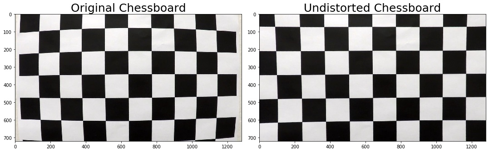
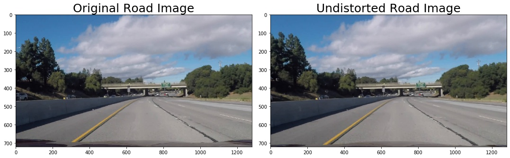
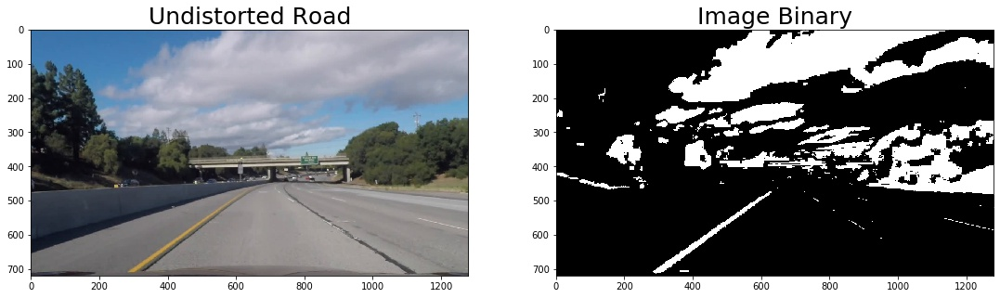
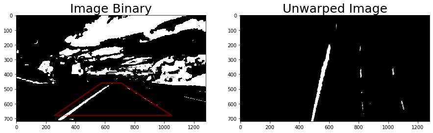
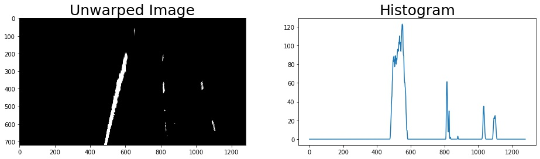
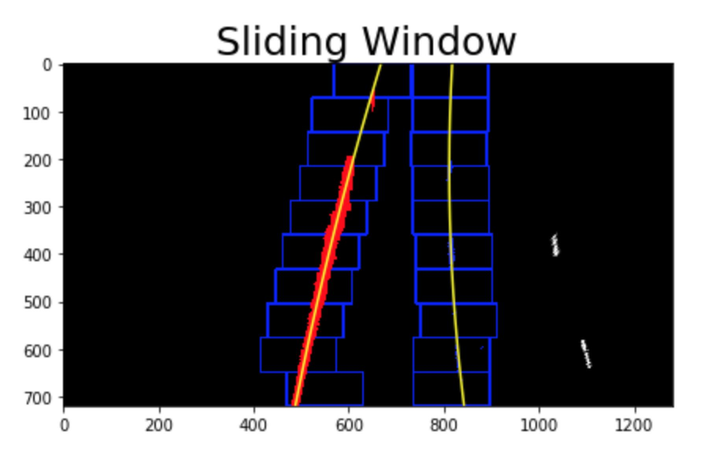
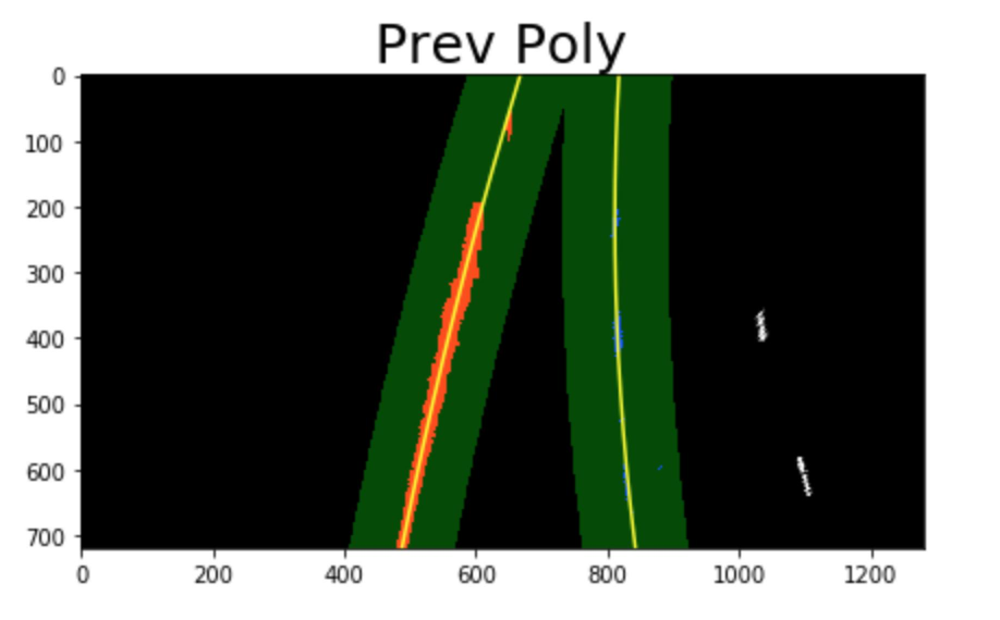
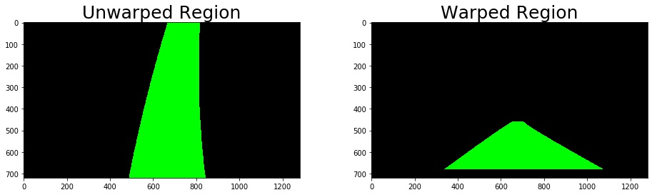
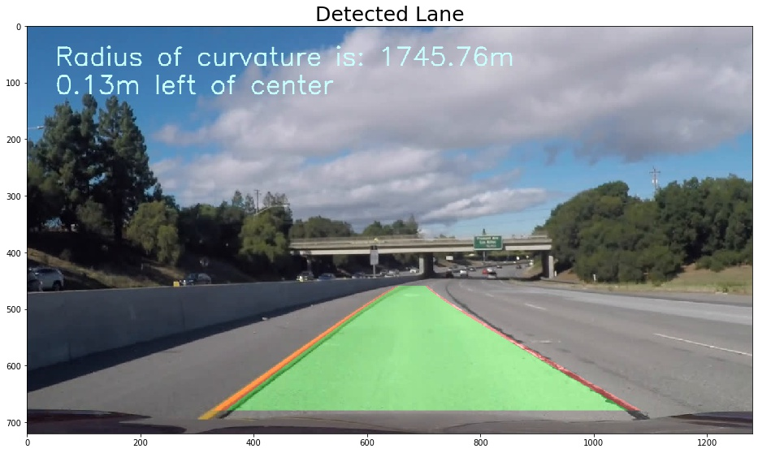
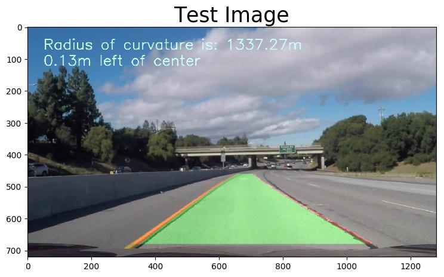

# Advanced Lane Lines Finding

## Overview

### Goals

1. Compute the camera calibration matrix and distortion coefficients given a set of chessboard images.
2. Apply a distortion correction to raw images.
3. Use color transforms, gradients, etc., to create a thresholded binary image.
4. Apply a perspective transform to rectify binary image ("birds-eye view").
5. Detect lane pixels and fit to find the lane boundary.
6. Determine the curvature of the lane and vehicle position with respect to center.
7. Warp the detected lane boundaries back onto the original image.
8. Output visual display of the lane boundaries and numerical estimation of lane curvature and vehicle position.
9. Have a Good performance in **challenge** video.

## 1. Camera calibration

- `cv2.findChessboardCorners` and `cv2.calibrateCamera` are used to get calibration matrix.
- This matrix makes distorted images to be undistorted.

### 1.1 Import useful modules

```python
import numpy as np
import cv2
import pickle
import glob
import matplotlib.pyplot as plt
import matplotlib.image as mpimg
```

### 1.2 Calibration matrix and Distortion coefficients

The object points is the (x,y,z) coordinates of the chessboard corners in the real world. Assume the chessboard is fixed on the z plane(z=0).

```python
# Camera calibration
def camera_calibration():
    # prepare object points, like (0,0,0), (1,0,0), (2,0,0) ....,(6,5,0)
    objp = np.zeros((6 * 9, 3), np.float32)
    objp[:, :2] = np.mgrid[0:9, 0:6].T.reshape(-1, 2)

    # Arrays to store object points and image points from all the images.
    objpoints = []  # 3d points in real world space
    imgpoints = []  # 2d points in image plane.

    # termination criteria
    criteria = (cv2.TERM_CRITERIA_EPS + cv2.TERM_CRITERIA_MAX_ITER, 30, 0.001)

    # image size
    img_size = None

    # Make a list of calibration images
    chessboard_images = glob.glob('./camera_cal/calibration*.jpg')

    for image in chessboard_images:
        img = mpimg.imread(image)
        gray = cv2.cvtColor(img, cv2.COLOR_RGB2GRAY)
        img_size = gray.shape[::-1]

        # Find the chessboard corners
        ret, corners = cv2.findChessboardCorners(gray, (9, 6), None)

        # If found, add object points, image points
        if ret == True:
            objpoints.append(objp)
            corners2 = cv2.cornerSubPix(gray, corners, (11, 11), (-1, -1), criteria)
            imgpoints.append(corners2)

    # mtx: Camera matrix
    # dist: Distortion coefficients
    ret, mtx, dist, rvecs, tvecs = cv2.calibrateCamera(objpoints, imgpoints, img_size, None, None)
    # Save the camera calibration result for later use (we won't worry about rvecs / tvecs)
    dist_pickle = {}
    dist_pickle['mtx'] = mtx
    dist_pickle['dist'] = dist
    print(mtx)
    print(dist)
    pickle.dump(dist_pickle, open('calibration.p', 'wb'))
```

### 1.3 Distortion correction

```python
# Distortion correction
def cal_undistort(img):
    # undistortion on the original image instead of gray-scaled image
    data = pickle.load(open('calibration.p', 'rb'))
    mtx, dist = data['mtx'], data['dist']
    undist = cv2.undistort(img, mtx, dist, None, mtx)
    return undist
```

### 1.4 Apply the distortion correction to a chessboard image



### 1.5 Apply the distortion correction to a road image




## 2. Image thresholding

- Image thresholding includes Extraction of l_channel from HLS color space and b_channel from LAB color space.
- Direction thresholding is also combined after color thresholding to highlight the lane lines from horizontal.

Updated: direction thresholding is removed due to lack of performance.

### 2.1 Threshold the image

Image thresholding includes Extraction of l_channel from HLS color space and b_channel from LAB color space.

```python
# Image thresholding
def image_thresh(img, l_thresh=(180 , 255), b_thresh=(185, 255)):
    new_img = np.copy(img)

    # 1) Convert to HLS color space
    hls = cv2.cvtColor(new_img, cv2.COLOR_RGB2HLS)
    l_channel = hls[:, :, 1]
    l_channel = l_channel * (255 / np.max(l_channel))
    # 2) Apply a threshold to the L channel
    l_binary = np.zeros_like(l_channel)
    l_binary[(l_channel > l_thresh[0]) & (l_channel <= l_thresh[1])] = 1

    # 3) Convert to LAB color space
    lab = cv2.cvtColor(new_img, cv2.COLOR_RGB2LAB)
    b_channel = lab[:, :, 2]
    # don't normalize if there are no yellows in the image
    if np.max(b_channel) > 175:
        b_channel = b_channel * (255 / np.max(b_channel))
    # 4) Apply a threshold to the B channel
    b_binary = np.zeros_like(b_channel)
    b_binary[(b_channel > b_thresh[0]) & (b_channel <= b_thresh[1])] = 1

    # 5) Apply a Sobel x to the x
    sobelx = cv2.Sobel(cv2.cvtColor(img, cv2.COLOR_RGB2GRAY), cv2.CV_64F, 1, 0)  # Take the derivative in x at b_channel
    abs_sobelx = np.absolute(sobelx)  # Absolute x derivative to accentuate lines away from horizontal
    sobely = cv2.Sobel(cv2.cvtColor(img, cv2.COLOR_RGB2GRAY), cv2.CV_64F, 0, 1)
    abs_sobely = np.absolute(sobely)  # Absolute x derivative to accentuate lines away from horizontal


    dir_grad = np.arctan2(abs_sobely, abs_sobelx)
    dir_binary = np.zeros_like(dir_grad)
    dir_binary[(dir_grad > 0) & (dir_grad <= 0.1)] = 1

    # scaled_sobel = np.uint8(255 * abs_sobelx / np.max(abs_sobelx))
    # sx_binary = np.zeros_like(scaled_sobel)
    # sx_binary[(scaled_sobel > sx_thresh[0]) & (scaled_sobel <= sx_thresh[1])] = 1

    combined_binary = np.zeros_like(b_binary)
    combined_binary[(l_binary == 1) | (b_binary == 1)] = 1
    # combined_binary[(l_binary == 1) | (b_binary == 1) | (dir_binary == 1)] = 1

    return combined_binary
```

### 2.2 Apply the image thresholding to the undistorted road image




## 3. Perspective Transform

Compute the perspective transform using source and destination points:

- M = `cv2.getPerspectiveTransform(src, dst)` # perspective matrix
- Minv = `cv2.getPerspectiveTransform(dst, src)` # inverse perspective matrix
- warped = `cv2.warpPerspective(img, M, img_size)` # "birds-eye" view after transform

```python
# Perspective transform
def perspective_tansform(img):
    '''
    src = np.float32([[,],[,],[,],[,]]) as four of the detected corners
    dst = np.float32([[,],[,],[,],[,]]) as destination points after transformation
    shape = [720, 1280]

    w = img_size[0] = img.shape[1]
    h = img_size[1] = img.shape[0]
    img_size = (h, w)
    '''

    h, w = img.shape[:2]
    img_size = (w, h)

    src = np.float32([[575, 460], [710, 460], [260, h-40], [1050, h-40]])
    offset = 450
    dst = np.float32([[offset, 0], [w-offset, 0], [offset, h], [w-offset, h]])

    M = cv2.getPerspectiveTransform(src, dst)
    Minv = cv2.getPerspectiveTransform(dst, src)
    warped = cv2.warpPerspective(img, M, img_size, flags=cv2.INTER_LINEAR)
    return warped, M, Minv
```

### 3.1 Apply the perspective transform to the image-thresholded road image




## 4. Detect lane lines

- #### Calculate Left/Right polynomial function and radius of curvature from unwarped (bird eye's view) image

- #### The steps for finding lane lines are as follow:

  1. Make **histogram** of bottom half of image.

     

  2. Find the **peak** of the left and right halves of the histogram. They are starting point for the left and right lines.

  3. Do `sliding_window_polyfit` from 0 to image height. Once the lines are detected and fitted, the step of sliding windows can be skipped using `prev_fit_polyfit`.

  4. **Fit** the result points with a second order polynomial.

  5. Calcualte the radius of curvatures with `radius_curvature` and cross track error using conversions in x and y from pixels space to meters.

  6. Draw the result on unwarped image.

  7. **Warp** the result image using inverse perspective transform `Minv`.

  **PS**: *In the video processing, there is no need to search all the intervals, the algorithm **remembers the line position in the previous frame** and search only near that line position. With this method, the calculation time can be greatly improved.*


### 4.1 Sliding window to find the lane pixels

1. Define 10 windows, the window's height is the height of image divide the number of windows.

2. Loop through those windows:

   - Identify window boundaries in x and y (and right and left).

   - Identify the nonzero pixels in the image and their index.
   - Identify the nonzero pixels in x and y within the window and append its index to each line.
   - If we found > minpix pixels, recenter next window, the new center is the mean of pixels positions.

3. Extract left and right line pixel positions.

4. The output of `sliding_window_polyfit()` looks like below.

**PS**: Once the lines are detected and fitted, the step of sliding windows can be skipped.



### 4.2 Previous polynomial to find the lane pixels

1. `prev_fit_polyfit` function performs basically the same task, but efficiently reduce difficulty of the search process by leveraging a previous fit (from a previous video frame, for example) and only searching for lane pixels within a certain range of that fit.

2. Once the lines where there were fitted has been found, in the **next frame** of video, it is not necessary to do a blind search again. Instead, **search in a margin** around the **previous line position** can be used to find the lane lines.



### 4.2 Radius of curvature of the lane

1. Determine the meters per pixel in y/x dimension.
2. Fit new polynomials to x,y in real world space.
3. Calculate the new radius of curvature which is in meters.
4. Calculate the position of the vehicle based on the center of the lane.

For example:

```python
left_cur, right_cur, ctb = radius_curvature(unwarped_road, left_fit_new, right_fit_new, left_lane_inds2, right_lane_inds2)
print('radius of curvature: %.3f m, %.3f m' % (left_cur, right_cur))
print('radius of curvature: %.3f m' % ((left_cur + right_cur)/2))
print('center: %.3f m' % (ctb))
```

```python
radius of curvature: 2186.001 m, 1305.509 m
radius of curvature: 1745.755 m
center: -0.133 m
```


## 5. Drawing on the image

- Until now, we have:

  - an original road image called road_imge

  - an unwarped binary image called unwarped_road

  - fitted lane lines with a polynomial left_fit, right_fit representing the x and y pixel values of the lines.

- Define a function `draw_lane` to project those lines onto the original image as a selected region.

- Define a function `draw_data` to write text (radius of curvature, center bias) on the image.

### 5.1 Extrace the lane regions both in warped and unwraped road image



### 5.2 Draw the detected lane back onto the original Image

```python
'''Draw onto the original image'''
drawed_img = draw_lane(road_img, unwarped_road, left_fit, right_fit, Minv)
rad_l, rad_r, center_bias = radius_curvature(unwarped_road, left_fit, right_fit, left_lane_inds, right_lane_inds)
detected_lane = draw_data(drawed_img, (rad_l + rad_r)/2, center_bias)
```




## 6. Video processing

- Define a image-processing pipeline including `Camera calibration`, `Image thresholding`, `Perspective Transform`, `Detect lane lines`, `Drawing`.
- Apply the pipeline to the given video.

### 6.1 Import required modules for video processing

```python
from moviepy.editor import VideoFileClip
from IPython.display import HTML
```

### 6.2 Define a Class `Line()` for storing lines information

```python
# Define a class to receive the characteristics of each line detection
class Line():
    def __init__(self):
        # was the line detected in the last iteration?
        self.detected = False
        # x values of the last n fits of the line
        self.recent_xfitted = []
        # average x values of the fitted line over the last n iterations
        self.bestx = None
        # polynomial coefficients averaged over the last n iterations
        self.best_fit = None
        # polynomial coefficients for the most recent fit
        self.current_fit = []
        # radius of curvature of the line in some units
        self.radius_of_curvature = None
        # distance in meters of vehicle center from the line
        self.line_base_pos = None
        # difference in fit coefficients between last and new fits
        self.diffs = np.array([0, 0, 0], dtype='float')
        # number of detected pixels
        self.px_count = None

    def add_fit(self, fit, inds):
        # add a found fit to the line, up to n
        n = 9
        if fit is not None:
            if self.best_fit is not None:
                # if we have a best fit, see how this new fit compares
                self.diffs = abs(fit - self.best_fit)
            if (self.diffs[0] > 0.001 or \
                self.diffs[1] > 1.0 or \
                self.diffs[2] > 100.) and \
                    len(self.current_fit) > 0:
                # bad fit! abort! abort! ... well, unless there are no fits in the current_fit queue, then we'll take it
                self.detected = False
            else:
                self.detected = True
                self.px_count = np.count_nonzero(inds)
                self.current_fit.append(fit)
                if len(self.current_fit) > n:
                    # throw out old fits, keep newest n
                    self.current_fit = self.current_fit[len(self.current_fit) - n:]
                self.best_fit = np.average(self.current_fit, axis=0)
        # or remove one from the history, if not found
        else:
            self.detected = False
            if len(self.current_fit) > 0:
                # throw out oldest fit
                self.current_fit = self.current_fit[:len(self.current_fit) - 1]
            if len(self.current_fit) > 0:
                # if there are still any fits in the queue, best_fit is their average
                self.best_fit = np.average(self.current_fit, axis=0)

l_line = Line()
r_line = Line()
```

### 6.3 Define a pipeline `image_process()`

- In order to integrate all needed functions to process images and then applied in video frames.

```python
def image_process(img):
    new_img = np.copy(img)
    # ----------------------------------------
    # Image Undistortion
    # ----------------------------------------
    undistort = cal_undistort(new_img)

    # ----------------------------------------
    # Image Thresholding
    # ----------------------------------------
    img_binary = image_thresh(undistort, l_thresh=(180, 255), b_thresh=(185,255))

    # ----------------------------------------
    # Perspective Transform
    # ----------------------------------------
    unwarped, _, Minv = perspective_tansform(img_binary)

    # ----------------------------------------
    # Lane Lines Finding
    # ----------------------------------------
    # if both left and right lines were detected last frame, `polyfit_using_prev_fit` is going to be applied
    # otherwise `sliding window` is selected
    if not l_line.detected or not r_line.detected:
        l_fit, r_fit, l_lane_inds, r_lane_inds, _ = sliding_window_polyfit(unwarped)
    else:
        l_fit, r_fit, l_lane_inds, r_lane_inds = prev_fit_polyfit(unwarped, l_line.best_fit, r_line.best_fit)

    # invalidate both fits if the difference in their x-intercepts isn't around 350 px (+/- 100 px)
    if l_fit is not None and r_fit is not None:
        # calculate x-intercept (bottom of image, x=image_height) for fits
        h = img.shape[0]
        l_fit_x_int = l_fit[0] * h ** 2 + l_fit[1] * h + l_fit[2]
        r_fit_x_int = r_fit[0] * h ** 2 + r_fit[1] * h + r_fit[2]
        x_int_diff = abs(r_fit_x_int - l_fit_x_int)
        if abs(350 - x_int_diff) > 100:
            l_fit = None
            r_fit = None

    l_line.add_fit(l_fit, l_lane_inds)
    r_line.add_fit(r_fit, r_lane_inds)

    # ----------------------------------------
    # Drawing
    # ----------------------------------------
    # Draw the lane & Write text onto the warped blank image

    if l_line.best_fit is not None and r_line.best_fit is not None:
        # draw the current best fit if it exists
        drawed_img = draw_lane(new_img, unwarped, l_line.best_fit, r_line.best_fit, Minv)
        rad_l, rad_r, d_center = radius_curvature(unwarped, l_line.best_fit, r_line.best_fit,
                                                               l_lane_inds, r_lane_inds)
        result = draw_data(drawed_img, (rad_l + rad_r) / 2, d_center)
    else:
        result = new_img

    return result
```

### 6.4 Test on a single image

```python
test_image = mpimg.imread('./test_images/challenge01.jpg')
result = image_process(test_image)
```



### 6.4 Test on the project_video (easy)

```python
output = 'output_videos/project_output.mp4'
clip1 = VideoFileClip('project_video.mp4')
output_clip = clip1.fl_image(image_process) 
output_clip.write_videofile(output, audio=False)
```


### 6.5 Test on the challenge_video (hard)

```python
challenge_output = "output_videos/challenge_output.mp4"
challenge_input = VideoFileClip("challenge_video.mp4")
video_process = challenge_input.fl_image(image_process)
video_process.write_videofile(challenge_output, audio=False)
```


## 7. Discussion

- It's hard to find the best threshold and hyperparameters.

- the first time when transforming perspective, the order of src points and dest ones is not same, so the bird-view picture is actually up-side down but its hard to notice and it can influence the result a lot.

- Class `Line()` can help to improve the performance of lane lines detection by the method of calculating the mean of last n(9 settled) found fits, which can smooth and stabilize the lane lines moving.